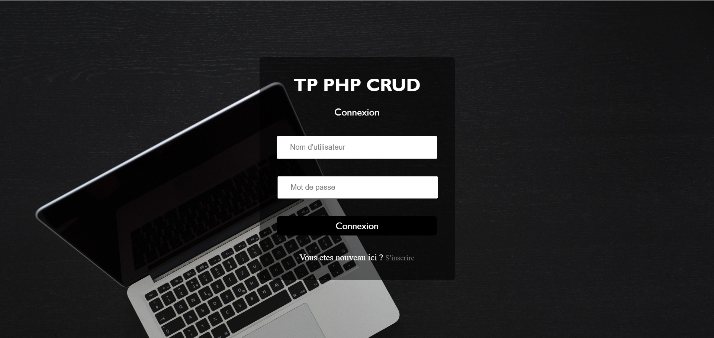
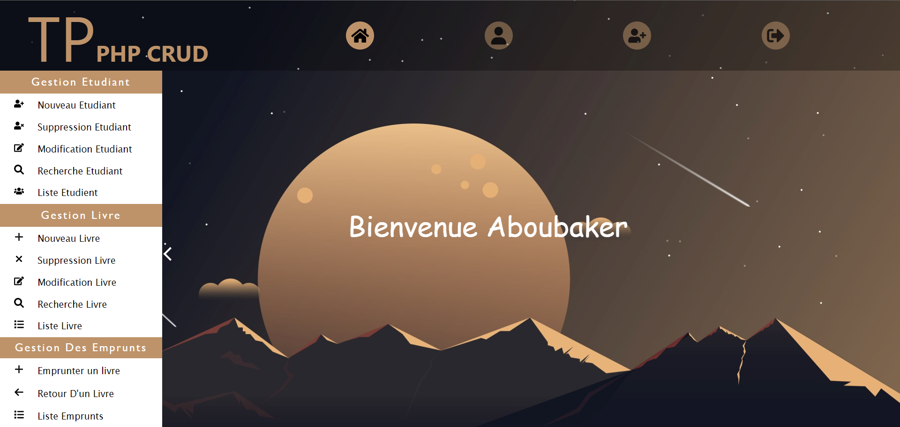

# My First PHP CRUD Application for Library Management

This is my first PHP CRUD (Create, Read, Update, Delete) application for a library management project. I have learned a lot during the development process. I have also used AJAX with the XMLHttpRequest class in JavaScript.

## Screenshots

## Description

In this project, I have developed a PHP application for managing a library's student and book records. The application allows users to perform CRUD operations on the database, enabling them to add, delete, update, and retrieve information about students and books.

Some key features of the application include:
- User registration and login functionality.
- Adding, deleting, updating, and retrieving student records.
- Adding, deleting, updating, and retrieving book records.
- Managing the relationship between students and books (e.g., tracking books borrowed by students).
- Displaying a list of all students and books in the library.
- Search functionality to find specific students or books.

The application utilizes a MySQL database to store student and book information. I have designed a database schema that includes tables for students, books, and their relationships.

Throughout the development process, I encountered various challenges and learned important concepts such as database connectivity, SQL queries, form validation, and handling HTTP requests asynchronously.

Overall, this project has been a great learning experience for me, providing valuable insights into PHP, CRUD operations, AJAX, and MySQL database management in the context of a library management system.

